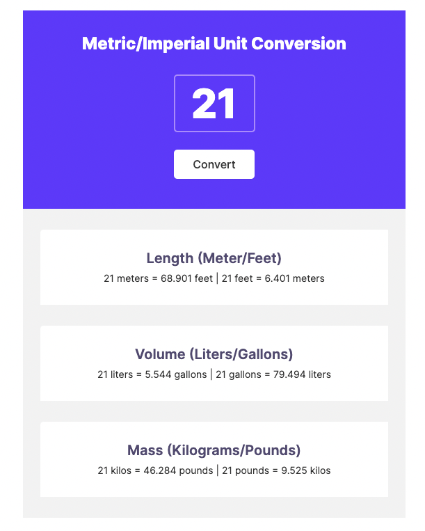

# Unit Converter

This app was made for Scrimba Front End Developer Path.

Unit converter app basically convert given input value from imperial to metric or from metric to imperial unit.

Shows given value as length, volume and mass.

Live Site : [Unit Converter](https://erencataltepe.github.io/unit-converter/)
